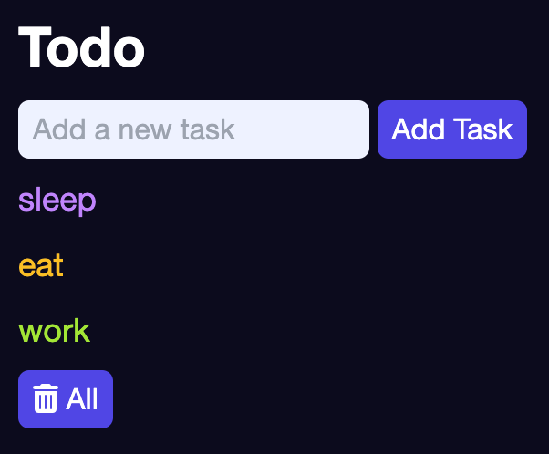

# Todo List Vanilla JS

This is a simple todo list made with vanilla JS that uses local storage to save the todos permanently in the browser.



## Installation

Clone the repository and open the index.html file in your browser.

```bash
git clone [repository]
```

## License

- [MIT](LICENSE.md)
